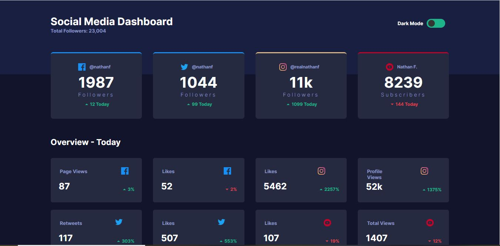
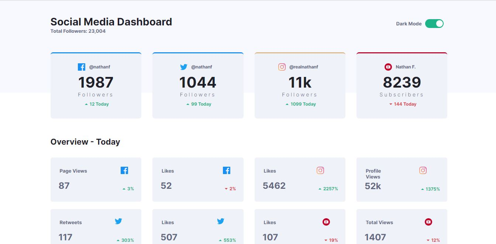
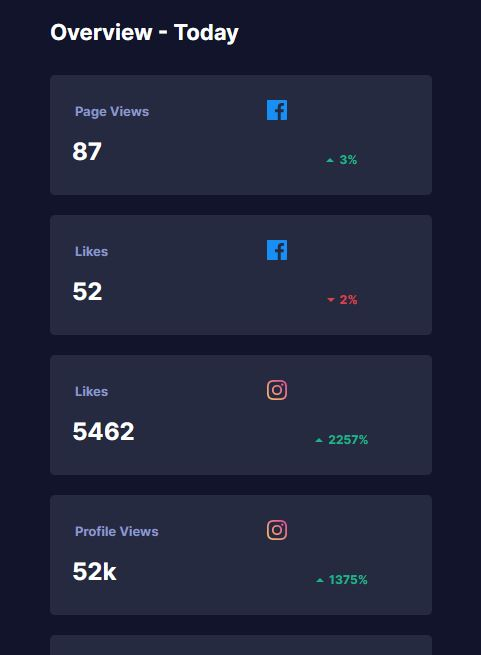

# Frontend Mentor - Social media dashboard with theme switcher solution

This is a solution to the [Social media dashboard with theme switcher challenge on Frontend Mentor](https://www.frontendmentor.io/challenges/social-media-dashboard-with-theme-switcher-6oY8ozp_H). Frontend Mentor challenges help you improve your coding skills by building realistic projects. 

## Table of contents

- [Overview](#overview)
  - [The challenge](#the-challenge)
  - [Screenshot](#screenshot)
  - [Links](#links)
- [My process](#my-process)
  - [Built with](#built-with)
  - [What I learned](#what-i-learned)
  - [Continued development](#continued-development)
  - [Useful resources](#useful-resources)
- [Author](#author)


## Overview

### The challenge

Users should be able to:

- View the optimal layout for the site depending on their device's screen size
- See hover states for all interactive elements on the page
- Toggle color theme to their preference

### Screenshot





### Links

- Solution URL: [Add solution URL here](https://github.com/N-Ignacio-Bouffanais/Social-media-dashboard)
- Live Site URL: [Add live site URL here](https://n-ignacio-bouffanais.github.io/Social-media-dashboard/)

## My process

### Built with

- Semantic HTML5 markup
- CSS custom properties
- Flexbox
- CSS Grid
- Mobile-first workflow
- linear-gradient
- css-grid-auto-fill

### What I learned

```css
.cards-container {
  padding: 0 10vw;
  display: grid;
  gap: 3rem;
  grid-auto-rows: 18rem;
  grid-template-columns: repeat(auto-fill, minmax(20rem, 1fr));
}
```
```js
function myFunction() {
    var element = document.body
    element.classList.toggle("light-mode")
}
```

### Continued development
I want to continue learning and making projects with javascript, css and html, and over time add tools like Eslint, reactjs, nextjs or maybe vuejs, sass, among others.

## Author

- Website - [Nicolas_Bouffanais](https://portfolio-nicolas-bouffanais.vercel.app/)
- Frontend Mentor - [@N-Ignacio-Bouffanais](https://www.frontendmentor.io/profile/N-Ignacio-Bouffanais)
- Twitter - [@N_Bouffanais](https://twitter.com/N_Bouffanais)

